<div align="center">

# API REST

### API REST para la gestión de inventario. 


## Integrantes - Grupo N-7

Iñaki Carcereny · Valentín De Pascale · Joaquín Marcilese · Ezequiel Barrionuevo · Alan Axel Hansen

</div>

---

## Descripción

API REST desarrollada con Node.js, Express y TypeScript para la gestión de inventario de pequeños negocios. Permite realizar operaciones CRUD sobre productos, categorías y movimientos de stock, con soporte para carga de imágenes mediante Cloudinary. Utiliza PostgreSQL como base de datos a través de Sequelize ORM, y está containerizada con Docker para facilitar el desarrollo y despliegue.

---

## Flujo y metodología de trabajo

| Rama | Descripción |
|------|-------------|
| `main` | Versión final de producción |
| `dev` | Integración de todas las features |
| `feature/*` | Nuevas funcionalidades |
| `refactor/*` | Mejoras y reestructuración del código |
| `docs/*` | Cambios en documentación |
| `fix/*` | Corrección de errores |

El proyecto siguió una metodología colaborativa basada en **Git Flow**, donde cada funcionalidad se desarrolló en ramas independientes con el prefijo `feature/`. Una vez verificado que la funcionalidad cumplía con los requerimientos, se abría un **Pull Request** hacia la rama `dev` para revisión del equipo antes de aprobar el merge. La entrega final se realizó mediante un merge a `main`.

La arquitectura del proyecto sigue el patrón **MVC**, separando la lógica en capas bien diferenciadas: las rutas en `/routes` delegan las requests a los controladores en `/controllers`, los cuales se encargan exclusivamente de las respuestas HTTP. La lógica de consultas a la base de datos reside en métodos estáticos dentro de los modelos en `/models`, escritos en **TypeScript** con **Sequelize** como ORM. Las validaciones de los datos entrantes se realizan en la capa de **middlewares**, antes de que la request llegue al controlador.

El entorno de desarrollo se estandarizó mediante **ESLint** y **Prettier** para mantener consistencia en el estilo del código, **Husky** con **lint-staged** para validar el formato y los errores antes de cada commit, **commitlint** para estandarizar los mensajes de commit, y **EditorConfig** junto con una configuración compartida de VSCode para garantizar uniformidad entre todos los integrantes del equipo.

El entorno de desarrollo está containerizado con **Docker**, utilizando **docker-compose** para orquestar los servicios de la API y la base de datos PostgreSQL. Las imágenes de productos se almacenan en **Cloudinary**. El despliegue de la API se realizó en **Render** mediante una imagen de Docker, y la base de datos PostgreSQL en **Neon**.

---

## Convención de commits

| Prefijo | Uso |
|---------|-----|
| `feat:` | Nueva funcionalidad |
| `fix:` | Corrección de bug |
| `docs:` | Cambios en documentación |
| `style:` | Cambios de formato o estilo de código |
| `refactor:` | Reorganización de código |
| `chore:` | Configuración, dependencias o tareas de mantenimiento |

---

## Estructura del proyecto

```
/
├── .husky/                  # Hooks de Git (pre-commit, commit-msg)
├── .vscode/                 # Configuración compartida del editor
├── controllers/             # Manejo de requests y respuestas HTTP
├── core/                    # Configuración central (servidor)
├── docs/                    # Archivos de documentación del proyecto (Postman, diagramas, etc.)
├── lib/                     # Utilidades internas (configuración de DB, Cloudinary, etc.)
├── middlewares/             # Validaciones y procesamiento de requests
├── models/                  # Entidades de la DB con métodos estáticos de consulta
├── routes/                  # Definición de endpoints y registro de middlewares
├── types/                   # Interfaces y tipos TypeScript compartidos
├── utils/                   # Funciones auxiliares (ej: carga de imágenes)
├── .dockerignore            # Archivos excluidos de la imagen Docker
├── .editorconfig            # Configuración de formato del editor
├── .env.example             # Variables de entorno requeridas
├── .eslintignore            # Archivos excluidos del linting
├── .eslintrc.cjs            # Configuración de ESLint
├── .gitignore               # Archivos excluidos del repositorio
├── .prettierignore          # Archivos excluidos del formateo
├── .prettierrc              # Configuración de Prettier
├── app.ts                   # Entry point: inicialización de DB y servidor
├── commitlint.config.ts     # Reglas para mensajes de commit
├── docker-compose.yml       # Orquestación de servicios (API + PostgreSQL)
├── Dockerfile               # Imagen Docker de la API
├── package.json             # Dependencias y scripts del proyecto
├── pnpm-workspace.yaml      # Configuración del workspace de pnpm
├── tsconfig.json            # Configuración del compilador TypeScript
└── README.md                # Documentación del proyecto
```

---

## División de tareas

| Integrante | Tareas |
|------------|--------|
| **Iñaki** | Modelos de `Product` y `Category`, rutas y controlador de productos, configuración y arquitectura del proyecto (ESLint, Prettier, Husky, commitlint, EditorConfig, VSCode, Docker), middleware de carga de imágenes con Multer y Cloudinary, documentación, despliegue de la API en Render y base de datos en Neon. |
| **Valentín** | Modelo de `Movement` y trigger de actualización de stock y movimientos, documentación de endpoints en Postman, despliegue de la API en Render y base de datos en Neon. |
| **Alan** | Rutas y controlador de categorías. |
| **Ezequiel** | Rutas y controlador de movimientos. |
| **Joaquín** | Middlewares de validación para productos, categorías y movimientos. |

---

## Diagrama

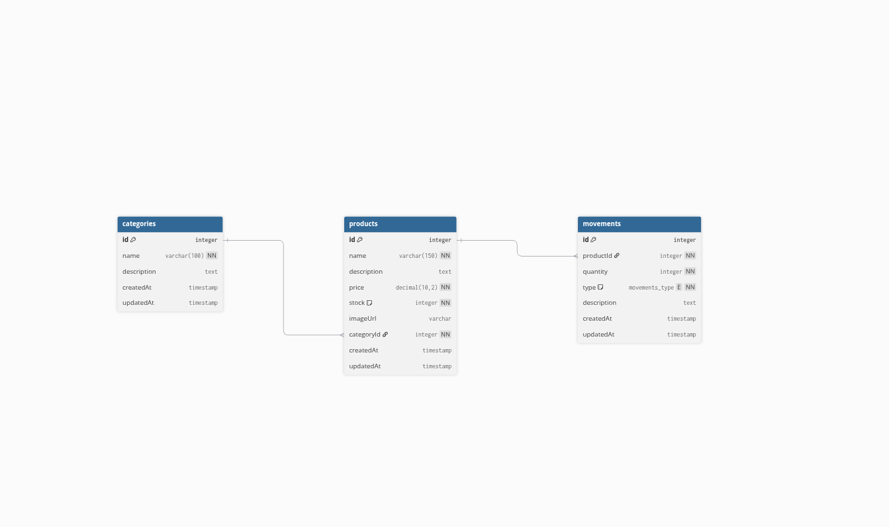

---

## Funcionalidades

| Feature | Descripción |
|---------|-------------|
| **Configuración del servidor** | El servidor se inicializa como una clase `Server` que registra middlewares, rutas y levanta la aplicación en el puerto definido por variable de entorno. |
| **Middlewares globales** | Se configuran CORS y parseo de JSON para las requests entrantes. |
| **Middlewares de validación** | Se aplican middlewares de validación antes de los endpoints `POST` y `PUT` de cada recurso, verificando tipos, campos obligatorios y formatos de datos. |
| **Carga de imágenes** | Se integra Multer para recibir archivos en las requests y Cloudinary para almacenarlos en la nube, guardando la URL resultante en la base de datos. |
| **GET /api/products** | Devuelve todos los productos. Soporta filtrado opcional por nombre (`search`) y categoría (`category`) mediante query params. |
| **GET /api/products/:id** | Busca y devuelve un producto específico por su ID, incluyendo los datos de su categoría. |
| **POST /api/products** | Valida los datos recibidos, sube la imagen a Cloudinary si se adjunta una, y crea un nuevo producto en la base de datos. |
| **PUT /api/products/:id** | Modifica los datos de un producto existente. Si se adjunta una nueva imagen, reemplaza la anterior en Cloudinary. |
| **DELETE /api/products/:id** | Elimina un producto de la base de datos a partir de su ID. |
| **GET /api/categories** | Devuelve todas las categorías disponibles. |
| **GET /api/categories/:id** | Busca y devuelve una categoría específica por su ID. |
| **POST /api/categories** | Valida los datos recibidos y crea una nueva categoría. |
| **PUT /api/categories/:id** | Modifica los datos de una categoría existente. |
| **DELETE /api/categories/:id** | Elimina una categoría de la base de datos a partir de su ID. |
| **GET /api/movements** | Devuelve todos los movimientos de stock registrados, incluyendo los datos del producto asociado. |
| **GET /api/movements/:id** | Busca y devuelve un movimiento específico por su ID. |
| **POST /api/movements** | Valida los datos recibidos y registra un nuevo movimiento de stock. Un trigger en la base de datos actualiza automáticamente el stock del producto afectado. |
| **Modelos** | Clases escritas en TypeScript con Sequelize que definen la estructura, tipos y métodos estáticos de consulta de cada entidad (`Product`, `Category`, `Movement`). |

**`Server`**

**`constructor()`:** Al instanciar la clase, crea la aplicación Express, define el puerto desde la variable de entorno `PORT` con fallback a `3000`, y llama a `middlewares()` y `routes()` para configurarlos al iniciar.
```ts
constructor() {
  this.app = express();
  this.port = process.env.PORT || 3000;
  this.middlewares();
  this.routes();
}
```

**`middlewares()`:** Registra los middlewares globales. `cors()` permite que el frontend pueda hacer peticiones al backend desde un origen distinto. `express.json()` habilita el parseo automático del body en formato JSON. `errorHandler` es el middleware centralizado de manejo de errores que captura cualquier error lanzado desde los controladores.
```ts
middlewares(): void {
  this.app.use(cors());
  this.app.use(express.json());
  this.app.use(errorHandler);
}
```

**`error.middleware.ts`:** Middleware centralizado de manejo de errores. Recibe cuatro parámetros `(err, _req, res, _next)`, lo que le indica a Express que es un manejador de errores. Verifica si el error es una instancia de `ValidationError` de Sequelize para retornar un `400` con el detalle de cada campo inválido. Cualquier otro error no controlado retorna un `500`.
```ts
export function errorHandler(
  err: Error | ValidationError,
  _req: Request,
  res: Response,
  _next: NextFunction,
): void {
  console.log(`[SERVER ERROR]: ${err.message}`);

  if (err instanceof ValidationError) {
    res.status(400).json({
      error: "Validation Error",
      details: err.errors.map((e) => ({
        message: e.message,
        field: e.path,
        value: e.value,
      })),
    });
    return;
  }

  res.status(500).json({
    error: "Internal Server Error",
    message: err.message,
  });
}
```

**`routes()`:** Registra las rutas de la API delegando cada endpoint a su archivo de rutas correspondiente. Incluye un endpoint `/api/health` para verificar que el servidor está activo.
```ts
routes(): void {
  this.app.use("/api/products", productRoutes);
  this.app.use("/api/categories", categoryRoutes);
  this.app.use("/api/movements", movementRoutes);
  this.app.get("/api/health", (_req, res) => {
    res.json({ status: "ok", timestamp: new Date() });
  });
}
```

**`listen()`:** Levanta el servidor en el puerto configurado y muestra un mensaje en consola confirmando que está escuchando.
```ts
listen(): void {
  this.app.listen(this.port, () => {
    console.log("Server is running on port " + this.port);
  });
}
```

**`models/index.ts`:** Centraliza las asociaciones entre modelos y la inicialización de triggers de la base de datos.

**Asociaciones:** Define las relaciones entre las entidades usando los métodos de Sequelize. `Category` tiene muchos `Product` y `Product` pertenece a una `Category`. A su vez, `Product` tiene muchos `Movement` y `Movement` pertenece a un `Product`.
```ts
Category.hasMany(Product, { foreignKey: "categoryId", as: "products" });
Product.belongsTo(Category, { foreignKey: "categoryId", as: "category" });
Product.hasMany(Movement, { foreignKey: "productId", as: "movements" });
Movement.belongsTo(Product, { foreignKey: "productId", as: "product" });
```

**`initDatabaseTriggers()`:** Crea un trigger en PostgreSQL que se ejecuta automáticamente después de cada `UPDATE` en la tabla `products`. Cuando el campo `stock` cambia, calcula la diferencia entre el valor anterior y el nuevo, determina si es un `ingreso` o un `egreso`, e inserta un registro en la tabla `movements` de forma automática. Esto garantiza que cada modificación de stock quede registrada sin intervención manual desde el backend.
```ts
export const initDatabaseTriggers = async (): Promise<void> => {
  try {
    await sequelize.query(`
      CREATE OR REPLACE FUNCTION log_movimiento_stock()
      RETURNS TRIGGER AS $$
      DECLARE
        diferencia INTEGER;
        tipo_movimiento VARCHAR;
        cantidad_movimiento INTEGER;
      BEGIN
        IF NEW.stock <> OLD.stock THEN
          diferencia := NEW.stock - OLD.stock;
          IF diferencia > 0 THEN
            tipo_movimiento := 'ingreso';
            cantidad_movimiento := diferencia;
          ELSE
            tipo_movimiento := 'egreso';
            cantidad_movimiento := diferencia * -1;
          END IF;
          INSERT INTO movements (product_id, quantity, type, description, created_at)
          VALUES (
            NEW.id,
            cantidad_movimiento,
            tipo_movimiento::enum_movements_type,
            'Cambio de stock en  un producto',
            NOW()
          );
        END IF;
        RETURN NEW;
      END;
      $$ LANGUAGE plpgsql;
    `);
    await sequelize.query(
      `DROP TRIGGER IF EXISTS trigger_log_movimientos ON products;`,
    );
    await sequelize.query(`
      CREATE TRIGGER trigger_log_movimientos
      AFTER UPDATE ON products
      FOR EACH ROW
      EXECUTE FUNCTION log_movimiento_stock();
    `);
    console.log("Database triggers initialized successfully.");
  } catch (error) {
    console.error("Error initializing database triggers:", error);
  }
};
```

**`app.ts`:** Punto de entrada de la aplicación. Autentica y sincroniza la conexión con la base de datos mediante Sequelize, inicializa los triggers de la base de datos, ejecuta el seed en entorno de desarrollo, y finalmente levanta el servidor.
```ts
async function main(): Promise<void> {
  await sequelize.authenticate();
  await sequelize.sync({ alter: true });
  await initDatabaseTriggers();
  if (process.env.NODE_ENV === "development") {
    await seed();
  }
  const server = new Server();
  server.listen();
}
main();
```

**`Category`**

Extiende la clase `Model` de Sequelize e implementa la interfaz `CategoryAttributes`, que define la estructura de la entidad. Los atributos se declaran con `declare` siguiendo la convención de TypeScript con Sequelize para evitar conflictos con el sistema de propiedades del ORM.

**Atributos**
| Atributo | Tipo | Requerido | Descripción |
|----------|------|-----------|-------------|
| `id` | `integer` | Auto | Clave primaria autoincremental |
| `name` | `varchar(100)` | Requerido | Nombre de la categoría |
| `description` | `text` | Opcional | Descripción opcional |
| `createdAt` | `timestamp` | Auto | Fecha de creación |
| `updatedAt` | `timestamp` | Auto | Fecha de última modificación |

**Métodos estáticos**

**`findAllCategories()`:** Retorna todas las categorías almacenadas en la base de datos.
```ts
static async findAllCategories(): Promise<Category[]> {
  return await Category.findAll();
}
```

**`findCategoryById(id)`:** Busca y retorna una categoría por su ID. Retorna `null` si no existe.
```ts
static async findCategoryById(id: number): Promise<Category | null> {
  return await Category.findByPk(id);
}
```

**`createCategory(data)`:** Crea y persiste una nueva categoría con los datos recibidos.
```ts
static async createCategory(data: CategoryCreationAttributes): Promise<Category> {
  return await Category.create(data);
}
```

**`updateCategory(id, data)`:** Busca una categoría por su ID y actualiza los campos recibidos. Retorna `null` si no existe.
```ts
static async updateCategory(id: number, data: Partial<CategoryAttributes>): Promise<Category | null> {
  const category = await Category.findByPk(id);
  if (!category) return null;
  return await category.update(data);
}
```

**`deleteCategory(id)`:** Busca una categoría por su ID y la elimina. Retorna `true` si fue eliminada, `false` si no existe.
```ts
static async deleteCategory(id: number): Promise<boolean> {
  const category = await Category.findByPk(id);
  if (!category) return false;
  await category.destroy();
  return true;
}
```

**`category.middleware.ts`:** Define dos middlewares de validación para el recurso de categorías.

**`validateCreateCategory`:** Valida los datos del body en el endpoint `POST`. Verifica que `name` esté presente, sea un texto y no supere los 100 caracteres. `description` es opcional pero si se envía debe ser un texto. Si hay errores retorna un `400` con el detalle, caso contrario llama a `next()`.
```ts
export const validateCreateCategory = (req, res, next) => {
  const { name, description } = req.body;
  const errors: string[] = [];
  if (!name) {
    errors.push("El nombre es obligatorio.");
  } else if (typeof name !== "string") {
    errors.push("El nombre debe ser un texto.");
  } else if (name.length > 100) {
    errors.push("El nombre no puede superar los 100 caracteres.");
  }
  if (description !== undefined && typeof description !== "string") {
    errors.push("La descripción debe ser un texto.");
  }
  if (errors.length > 0) {
    res.status(400).json({ message: "Error de validación", errors });
    return;
  }
  next();
};
```

**`validateUpdateCategory`:** Valida los datos del body en el endpoint `PUT`. A diferencia del anterior, todos los campos son opcionales — solo valida los que estén presentes en el body. Si `name` se envía, verifica que sea un texto y no supere los 100 caracteres. Si hay errores retorna un `400` con el detalle, caso contrario llama a `next()`.
```ts
export const validateUpdateCategory = (req, res, next) => {
  const { name, description } = req.body;
  const errors: string[] = [];
  if (name !== undefined) {
    if (typeof name !== "string") {
      errors.push("El nombre debe ser un texto.");
    } else if (name.length > 100) {
      errors.push("El nombre no puede superar los 100 caracteres.");
    }
  }
  if (description !== undefined && typeof description !== "string") {
    errors.push("La descripción debe ser un texto.");
  }
  if (errors.length > 0) {
    res.status(400).json({ message: "Error de validación", errors });
    return;
  }
  next();
};
```

**`category.routes.ts`:** Define las rutas del recurso `/api/categories` usando `Router` de Express. Cada ruta delega la lógica a su controlador correspondiente. Los endpoints `POST` y `PUT` incluyen sus respectivos middlewares de validación antes del controlador para verificar los datos del body antes de procesarlos.
```ts
router.get("/", getCategories);
router.get("/:id", getCategoryById);
router.post("/", validateCreateCategory, createCategory);
router.put("/:id", validateUpdateCategory, updateCategory);
router.delete("/:id", deleteCategory);
```

**`category.controller.ts`:** Contiene las funciones controladoras del recurso de categorías. Cada función recibe la request, delega la lógica de consulta al modelo y devuelve la respuesta HTTP correspondiente. Los errores se propagan mediante `next(error)` al middleware centralizado de manejo de errores.

**`getCategories()`:** Llama a `Category.findAllCategories()` y retorna el listado completo de categorías con un `200`.
```ts
export async function getCategories(
  _req: Request,
  res: Response,
  next: NextFunction,
): Promise<void> {
  try {
    const categories = await Category.findAllCategories();
    res.json(categories);
  } catch (error) {
    next(error);
  }
}
```

**`getCategoryById()`:** Obtiene el `id` desde `req.params`, llama a `Category.findCategoryById(id)` y retorna la categoría con un `200`. Si no existe retorna un `404`.
```ts
export async function getCategoryById(
  req: Request,
  res: Response,
  next: NextFunction,
): Promise<void> {
  try {
    const id = Number(req.params.id);
    const category = await Category.findCategoryById(id);
    if (!category) {
      res.status(404).json({ error: "Category not found" });
      return;
    }
    res.json(category);
  } catch (error) {
    next(error);
  }
}
```

**`createCategory()`:** Pasa el `req.body` directamente a `Category.createCategory()` y retorna la categoría creada con un `201`.
```ts
export async function createCategory(
  req: Request,
  res: Response,
  next: NextFunction,
): Promise<void> {
  try {
    const category = await Category.createCategory(req.body);
    res.status(201).json(category);
  } catch (error) {
    next(error);
  }
}
```

**`updateCategory()`:** Obtiene el `id` desde `req.params` y llama a `Category.updateCategory()` con los datos del `req.body`. Si no existe retorna un `404`, caso contrario retorna un mensaje de éxito junto con la categoría actualizada.
```ts
export async function updateCategory(
  req: Request,
  res: Response,
  next: NextFunction,
): Promise<void> {
  try {
    const id = Number(req.params.id);
    const category = await Category.updateCategory(id, req.body);
    if (!category) {
      res.status(404).json({ error: "Category not found" });
      return;
    }
    res.json({ message: "Category updated successfully", category });
  } catch (error) {
    next(error);
  }
}
```

**`deleteCategory()`:** Obtiene el `id` desde `req.params` y llama a `Category.deleteCategory()`. Si retorna `false` significa que no existe y devuelve un `404`, caso contrario retorna un `200` con un mensaje de éxito.
```ts
export async function deleteCategory(
  req: Request,
  res: Response,
  next: NextFunction,
): Promise<void> {
  try {
    const id = Number(req.params.id);
    const deleted = await Category.deleteCategory(id);
    if (!deleted) {
      res.status(404).json({ error: "Category not found" });
      return;
    }
    res.status(200).json({ message: "Category deleted successfully" });
  } catch (error) {
    next(error);
  }
}
```

**`Product`**

Extiende la clase `Model` de Sequelize e implementa la interfaz `ProductAttributes`. El atributo `categoryId` define una clave foránea que referencia a la tabla `categories`, con `CASCADE` en actualizaciones y `RESTRICT` en eliminaciones para evitar borrar categorías con productos asociados. El import de `Category` dentro de los métodos estáticos es dinámico para evitar imports circulares entre modelos.

**Atributos**
| Atributo | Tipo | Requerido | Descripción |
|----------|------|-----------|-------------|
| `id` | `integer` | Auto | Clave primaria autoincremental |
| `name` | `varchar(150)` | Requerido | Nombre del producto |
| `description` | `text` | Opcional | Descripción opcional |
| `price` | `decimal(10,2)` | Requerido | Precio del producto |
| `stock` | `integer` | Requerido | Cantidad en stock, por defecto `0` |
| `imageUrl` | `varchar` | Opcional | URL de la imagen almacenada en Cloudinary |
| `categoryId` | `integer` | Requerido | Clave foránea que referencia a `categories` |
| `createdAt` | `timestamp` | Auto | Fecha de creación |
| `updatedAt` | `timestamp` | Auto | Fecha de última modificación |

**Métodos estáticos**

**`findAllProducts(search?, categoryId?)`:** Retorna todos los productos incluyendo su categoría asociada. Soporta filtrado opcional por nombre mediante `Op.iLike` (búsqueda case-insensitive) y por `categoryId`. Ambos filtros se pueden combinar.
```ts
static async findAllProducts(
  search?: string,
  categoryId?: string,
): Promise<Product[]> {
  const { Category } = await import("./index");
  const where: Record<string, unknown> = {};
  if (search) {
    where.name = { [Op.iLike]: `%${search}%` };
  }
  if (categoryId) {
    where.categoryId = categoryId;
  }
  return await Product.findAll({
    where,
    include: [{ model: Category, as: "category" }],
  });
}
```

**`findProductById(id)`:** Busca y retorna un producto por su ID incluyendo su categoría asociada. Retorna `null` si no existe.
```ts
static async findProductById(id: number): Promise<Product | null> {
  const { Category } = await import("./index");
  return await Product.findByPk(id, {
    include: [{ model: Category, as: "category" }],
  });
}
```

**`createProduct(data)`:** Crea y persiste un nuevo producto con los datos recibidos.
```ts
static async createProduct(
  data: ProductCreationAttributes,
): Promise<Product> {
  return await Product.create(data);
}
```

**`updateProduct(id, data)`:** Busca un producto por su ID y actualiza los campos recibidos. Retorna `null` si no existe.
```ts
static async updateProduct(
  id: number,
  data: Partial<ProductAttributes>,
): Promise<Product | null> {
  const product = await Product.findByPk(id);
  if (!product) return null;
  return await product.update(data);
}
```

**`deleteProduct(id)`:** Busca un producto por su ID y lo elimina. Retorna `true` si fue eliminado, `false` si no existe.
```ts
static async deleteProduct(id: number): Promise<boolean> {
  const product = await Product.findByPk(id);
  if (!product) return false;
  await product.destroy();
  return true;
}
```

**`product.middleware.ts`:** Define dos middlewares de validación para el recurso de productos.

**`validateCreateProduct`:** Valida los datos del body en el endpoint `POST`. Verifica que `name`, `price` y `categoryId` estén presentes y sean válidos. Como los valores numéricos pueden llegar como strings desde un `form-data`, parsea `price`, `categoryId` y `stock` con `Number()` antes de validarlos. Si las validaciones pasan, sobreescribe los valores en `req.body` con los ya parseados para que el controlador reciba los tipos correctos. Si hay errores retorna un `400` con el detalle, caso contrario llama a `next()`.
```ts
export const validateCreateProduct = (req, res, next) => {
  const { name, description, price, stock, imageUrl, categoryId } = req.body;
  const errors: string[] = [];
  if (!name || typeof name !== "string" || name.length > 150) {
    errors.push("El nombre es obligatorio, debe ser texto y tener máximo 150 caracteres.");
  }
  const parsedPrice = Number(price);
  if (!price || isNaN(parsedPrice) || parsedPrice <= 0) {
    errors.push("El precio es obligatorio y debe ser un número mayor a 0.");
  }
  const parsedCategoryId = Number(categoryId);
  if (!categoryId || isNaN(parsedCategoryId)) {
    errors.push("El ID de la categoría es obligatorio y debe ser un número.");
  }
  const parsedStock = stock !== undefined ? Number(stock) : undefined;
  if (parsedStock !== undefined && (isNaN(parsedStock) || parsedStock < 0)) {
    errors.push("El stock debe ser un número positivo.");
  }
  if (description !== undefined && typeof description !== "string") {
    errors.push("La descripción debe ser un texto.");
  }
  if (imageUrl !== undefined && typeof imageUrl !== "string") {
    errors.push("La URL de la imagen debe ser un texto válido.");
  }
  if (errors.length > 0) {
    res.status(400).json({ message: "Error de validación", errors });
    return;
  }
  req.body.price = parsedPrice;
  req.body.categoryId = parsedCategoryId;
  if (parsedStock !== undefined) req.body.stock = parsedStock;
  next();
};
```

**`validateUpdateProduct`:** Valida los datos del body en el endpoint `PUT`. A diferencia del anterior, todos los campos son opcionales — solo valida y parsea los que estén presentes en el body. Si `price`, `categoryId` o `stock` se envían, los parsea con `Number()` y los sobreescribe en `req.body` antes de llamar a `next()`.
```ts
export const validateUpdateProduct = (req, res, next) => {
  const { name, description, price, stock, imageUrl, categoryId } = req.body;
  const errors: string[] = [];
  if (name !== undefined && (typeof name !== "string" || name.length > 150)) {
    errors.push("El nombre debe ser texto y tener máximo 150 caracteres.");
  }
  if (price !== undefined) {
    const parsedPrice = Number(price);
    if (isNaN(parsedPrice) || parsedPrice <= 0) {
      errors.push("El precio debe ser un número mayor a 0.");
    } else {
      req.body.price = parsedPrice;
    }
  }
  if (categoryId !== undefined) {
    const parsedCategoryId = Number(categoryId);
    if (isNaN(parsedCategoryId)) {
      errors.push("El ID de la categoría debe ser un número.");
    } else {
      req.body.categoryId = parsedCategoryId;
    }
  }
  if (stock !== undefined) {
    const parsedStock = Number(stock);
    if (isNaN(parsedStock) || parsedStock < 0) {
      errors.push("El stock debe ser un número positivo.");
    } else {
      req.body.stock = parsedStock;
    }
  }
  if (description !== undefined && typeof description !== "string") {
    errors.push("La descripción debe ser un texto.");
  }
  if (imageUrl !== undefined && typeof imageUrl !== "string") {
    errors.push("La URL de la imagen debe ser un texto válido.");
  }
  if (errors.length > 0) {
    res.status(400).json({ message: "Error de validación", errors });
    return;
  }
  next();
};
```

**`product.routes.ts`:** Define las rutas del recurso `/api/products` usando `Router` de Express. Cada ruta delega la lógica a su controlador correspondiente. Los endpoints `POST` y `PUT` pasan primero por `upload.single("image")` para procesar el archivo adjunto mediante Multer, luego por su middleware de validación, y finalmente llegan al controlador.
```ts
router.get("/", getProducts);
router.get("/:id", getProductById);
router.post("/", upload.single("image"), validateCreateProduct, createProduct);
router.put("/:id", upload.single("image"), validateUpdateProduct, updateProduct);
router.delete("/:id", deleteProduct);
```

**`product.controller.ts`:** Contiene las funciones controladoras del recurso de productos. Cada función recibe la request, delega la lógica de consulta al modelo y devuelve la respuesta HTTP correspondiente. Los errores se propagan mediante `next(error)` al middleware centralizado de manejo de errores.

**`getProducts()`:** Extrae los query params `search` y `category` de `req.query` y los pasa a `Product.findAllProducts()`. Retorna el listado de productos con un `200`.
```ts
export async function getProducts(
  req: Request,
  res: Response,
  next: NextFunction,
): Promise<void> {
  try {
    const { search, category } = req.query;
    const products = await Product.findAllProducts(
      search as string | undefined,
      category as string | undefined,
    );
    res.json(products);
  } catch (error) {
    next(error);
  }
}
```

**`getProductById()`:** Obtiene el `id` desde `req.params`, llama a `Product.findProductById(id)` y retorna el producto con un `200`. Si no existe retorna un `404`.
```ts
export async function getProductById(
  req: Request,
  res: Response,
  next: NextFunction,
): Promise<void> {
  try {
    const id = Number(req.params.id);
    const product = await Product.findProductById(id);
    if (!product) {
      res.status(404).json({ error: "Product not found" });
      return;
    }
    res.json(product);
  } catch (error) {
    next(error);
  }
}
```

**`createProduct()`:** Si se adjuntó un archivo en la request, lo sube a Cloudinary mediante `uploadImage()` y obtiene la URL resultante. Luego pasa el `req.body` junto con el `imageUrl` a `Product.createProduct()` y retorna el producto creado con un `201`.
```ts
export async function createProduct(
  req: Request,
  res: Response,
  next: NextFunction,
): Promise<void> {
  try {
    let imageUrl: string | undefined;
    if (req.file) {
      imageUrl = await uploadImage(req.file.buffer, "products");
    }
    const product = await Product.createProduct({ ...req.body, imageUrl });
    res.status(201).json(product);
  } catch (error) {
    next(error);
  }
}
```

**`updateProduct()`:** Obtiene el `id` desde `req.params`. Si se adjuntó una nueva imagen, la sube a Cloudinary y reemplaza el `imageUrl` anterior. Llama a `Product.updateProduct()` con los datos actualizados. Si no existe retorna un `404`, caso contrario retorna un mensaje de éxito junto con el producto actualizado.
```ts
export async function updateProduct(
  req: Request,
  res: Response,
  next: NextFunction,
): Promise<void> {
  try {
    const id = Number(req.params.id);
    let imageUrl: string | undefined;
    if (req.file) {
      imageUrl = await uploadImage(req.file.buffer, "products");
    }
    const product = await Product.updateProduct(id, {
      ...req.body,
      ...(imageUrl && { imageUrl }),
    });
    if (!product) {
      res.status(404).json({ error: "Product not found" });
      return;
    }
    res.json({ message: "Product updated successfully", product });
  } catch (error) {
    next(error);
  }
}
```

**`deleteProduct()`:** Obtiene el `id` desde `req.params` y llama a `Product.deleteProduct()`. Si retorna `false` significa que no existe y devuelve un `404`, caso contrario retorna un `200` con un mensaje de éxito.
```ts
export async function deleteProduct(
  req: Request,
  res: Response,
  next: NextFunction,
): Promise<void> {
  try {
    const id = Number(req.params.id);
    const deleted = await Product.deleteProduct(id);
    if (!deleted) {
      res.status(404).json({ error: "Product not found" });
      return;
    }
    res.status(200).json({ message: "Product deleted successfully" });
  } catch (error) {
    next(error);
  }
}
```

**`Movement`**

Extiende la clase `Model` de Sequelize e implementa la interfaz `MovementAttributes`. El atributo `productId` define una clave foránea que referencia a la tabla `products`, con `CASCADE` en actualizaciones y `RESTRICT` en eliminaciones. El tipo se define como un `ENUM` que solo acepta los valores `'ingreso'` o `'egreso'`. A diferencia de `Product` y `Category`, no expone métodos de actualización ni eliminación ya que los movimientos son registros inmutables — la única forma de modificar el stock es a través del trigger de la base de datos.

**Atributos**
| Atributo | Tipo | Requerido | Descripción |
|----------|------|-----------|-------------|
| `id` | `integer` | Auto | Clave primaria autoincremental |
| `productId` | `integer` | Requerido | Clave foránea que referencia a `products` |
| `quantity` | `integer` | Requerido | Cantidad del movimiento |
| `type` | `enum` | Requerido | Tipo de movimiento: `'ingreso'` o `'egreso'` |
| `description` | `text` | Opcional | Descripción opcional del movimiento |
| `createdAt` | `timestamp` | Auto | Fecha de creación |
| `updatedAt` | `timestamp` | Auto | Fecha de última modificación |

**Métodos estáticos**

**`findAllMovements()`:** Retorna todos los movimientos incluyendo el producto asociado.
```ts
static async findAllMovements(): Promise<Movement[]> {
  const { Product } = await import("./index");
  return await Movement.findAll({
    include: [{ model: Product, as: "product" }],
  });
}
```

**`findMovementById(id)`:** Busca y retorna un movimiento por su ID incluyendo el producto asociado. Retorna `null` si no existe.
```ts
static async findMovementById(id: number): Promise<Movement | null> {
  const { Product } = await import("./index");
  return await Movement.findByPk(id, {
    include: [{ model: Product, as: "product" }],
  });
}
```

**`createMovement(data)`:** Crea y persiste un nuevo movimiento con los datos recibidos. El trigger de la base de datos se encarga automáticamente de actualizar el stock del producto afectado.
```ts
static async createMovement(
  data: MovementCreationAttributes,
): Promise<Movement> {
  return await Movement.create(data);
}
```

**`movements.middleware.ts`:** Define el middleware de validación para el recurso de movimientos. A diferencia de los otros recursos, solo tiene un middleware ya que los movimientos no tienen endpoint `PUT` — son registros inmutables.

**`validateMovement`:** Valida los datos del body en el endpoint `POST`. Verifica que `productId`, `quantity` y `type` estén presentes y sean válidos. Como `productId` y `quantity` pueden llegar como strings desde el body, los parsea con `Number()` antes de validarlos. `type` solo acepta los valores `'ingreso'` o `'egreso'`. Si las validaciones pasan, sobreescribe los valores numéricos en `req.body` con los ya parseados. Si hay errores retorna un `400` con el detalle, caso contrario llama a `next()`.
```ts
export const validateMovement = (req, res, next) => {
  const { productId, quantity, type, description } = req.body;
  const errors: string[] = [];
  const parsedProductId = Number(productId);
  if (!productId || isNaN(parsedProductId)) {
    errors.push("El ID del producto es obligatorio y debe ser un número.");
  }
  const parsedQuantity = Number(quantity);
  if (!quantity || isNaN(parsedQuantity) || parsedQuantity <= 0) {
    errors.push("La cantidad es obligatoria y debe ser mayor a 0.");
  }
  if (!type || (type !== "ingreso" && type !== "egreso")) {
    errors.push("El tipo es obligatorio y debe ser 'ingreso' o 'egreso'.");
  }
  if (description !== undefined && typeof description !== "string") {
    errors.push("La descripción debe ser un texto.");
  }
  if (errors.length > 0) {
    res.status(400).json({ message: "Error de validación", errors });
    return;
  }
  req.body.productId = parsedProductId;
  req.body.quantity = parsedQuantity;
  next();
};
```

**`movements.routes.ts`:** Define las rutas del recurso `/api/movements` usando `Router` de Express. A diferencia de los otros recursos, solo expone tres endpoints ya que los movimientos son registros inmutables — no se pueden modificar ni eliminar. El endpoint `POST` pasa por el middleware `validateMovement` antes de llegar al controlador.
```ts
router.get("/", getMovements);
router.get("/:id", getMovementById);
router.post("/", validateMovement, createMovement);
```

**`movements.controller.ts`:** Contiene las funciones controladoras del recurso de movimientos. Al igual que las rutas, solo expone tres funciones ya que los movimientos son registros inmutables. Los errores se propagan mediante `next(error)` al middleware centralizado de manejo de errores.

**`getMovements()`:** Llama a `Movement.findAllMovements()` y retorna el listado completo de movimientos con su producto asociado con un `200`.
```ts
export async function getMovements(
  _req: Request,
  res: Response,
  next: NextFunction,
): Promise<void> {
  try {
    const movements = await Movement.findAllMovements();
    res.json(movements);
  } catch (error) {
    next(error);
  }
}
```

**`getMovementById()`:** Obtiene el `id` desde `req.params`, llama a `Movement.findMovementById(id)` y retorna el movimiento con su producto asociado con un `200`. Si no existe retorna un `404`.
```ts
export async function getMovementById(
  req: Request,
  res: Response,
  next: NextFunction,
): Promise<void> {
  try {
    const id = Number(req.params.id);
    const movement = await Movement.findMovementById(id);
    if (!movement) {
      res.status(404).json({ error: "Movement not found" });
      return;
    }
    res.json(movement);
  } catch (error) {
    next(error);
  }
}
```

**`createMovement()`:** Pasa el `req.body` directamente a `Movement.createMovement()` y retorna el movimiento creado con un `201`. El trigger de la base de datos se encarga automáticamente de actualizar el stock del producto afectado.
```ts
export async function createMovement(
  req: Request,
  res: Response,
  next: NextFunction,
): Promise<void> {
  try {
    const movement = await Movement.createMovement(req.body);
    res.status(201).json(movement);
  } catch (error) {
    next(error);
  }
}
```

**`upload.middleware.ts`:** Configura Multer para el procesamiento de imágenes en los endpoints que las reciben. Usa `memoryStorage()` para mantener el archivo en memoria como un `Buffer` en lugar de guardarlo en disco, ya que se envía directamente a Cloudinary sin persistencia local. Limita el tamaño máximo a `5MB` y restringe los tipos de archivo a `jpeg`, `png` y `webp`. Si el tipo no es válido lanza un error que es capturado por el middleware de errores.
```ts
const storage = multer.memoryStorage();
const upload = multer({
  storage,
  limits: {
    fileSize: 5 * 1024 * 1024,
  },
  fileFilter: (_req, file, cb) => {
    const allowedTypes = ["image/jpeg", "image/png", "image/webp"];
    if (allowedTypes.includes(file.mimetype)) {
      cb(null, true);
    } else {
      cb(new Error("Only images are allowed (jpeg, png, webp)"));
    }
  },
});
```

**`upload-image.ts`:** Función utilitaria que recibe el `Buffer` del archivo procesado por Multer y el nombre del folder de destino en Cloudinary, y retorna la URL segura (`secure_url`) de la imagen subida. Utiliza `upload_stream` ya que el archivo está en memoria como `Buffer` y no como un archivo en disco. Si ocurre un error durante la subida, rechaza la promesa con el error de Cloudinary o un error genérico.
```ts
export async function uploadImage(
  fileBuffer: Buffer,
  folder: string,
): Promise<string> {
  return new Promise((resolve, reject) => {
    cloudinary.uploader
      .upload_stream({ folder }, (error, result) => {
        if (error || !result) {
          reject(error ?? new Error("Error uploading image to Cloudinary"));
          return;
        }
        resolve(result.secure_url);
      })
      .end(fileBuffer);
  });
}
```

---

## Documentacion de la API

[Ver documentación completa en Postman](https://documenter.getpostman.com/view/50197693/2sBXwvK8uE)

### Categories

#### GET /api/categories
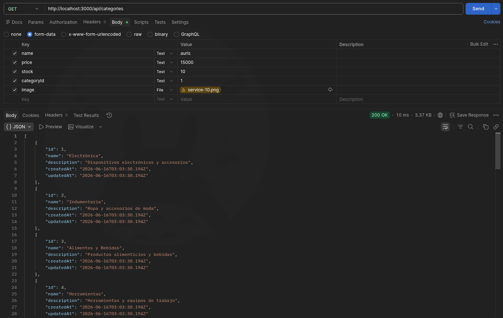

#### GET /api/categories/:id
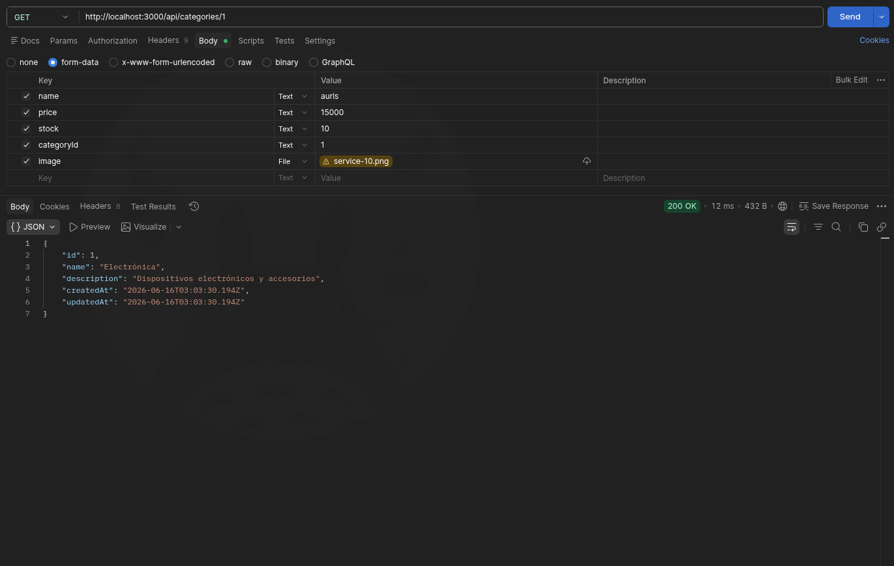
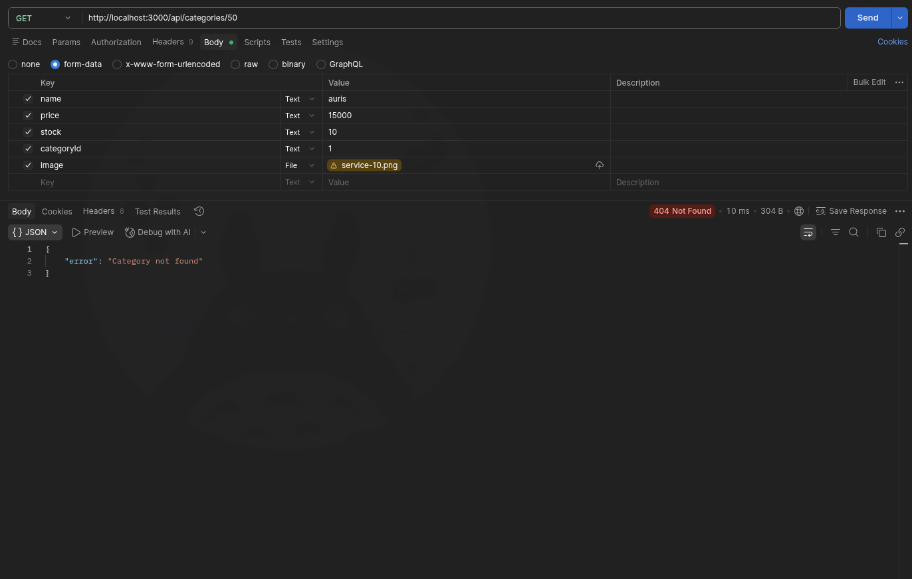

#### POST /api/categories
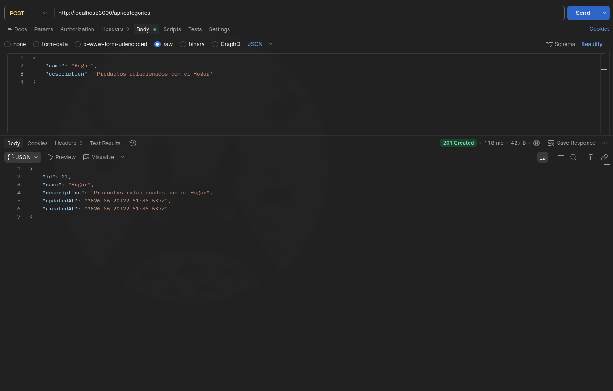


#### PUT /api/categories/:id
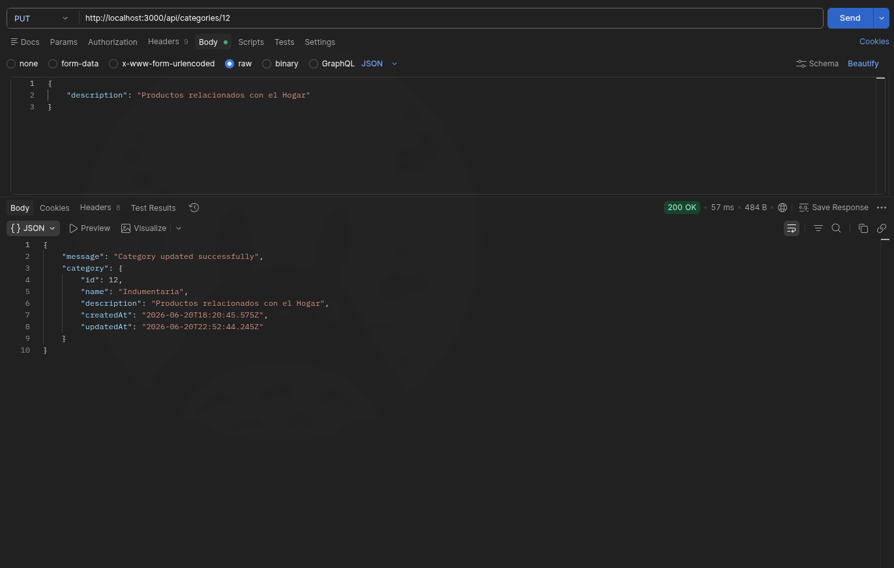


#### DELETE /api/categories/:id


### Products

#### GET /api/products


#### GET /api/products?search=
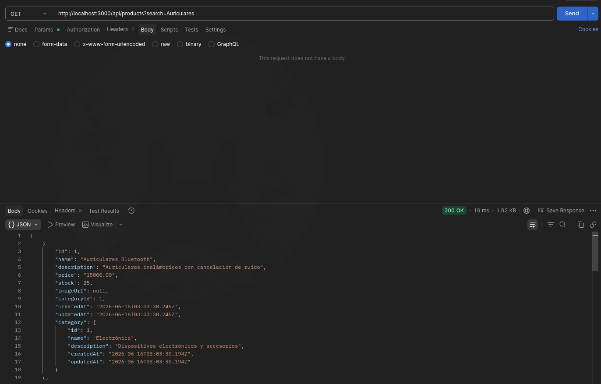

#### GET /api/products?category=
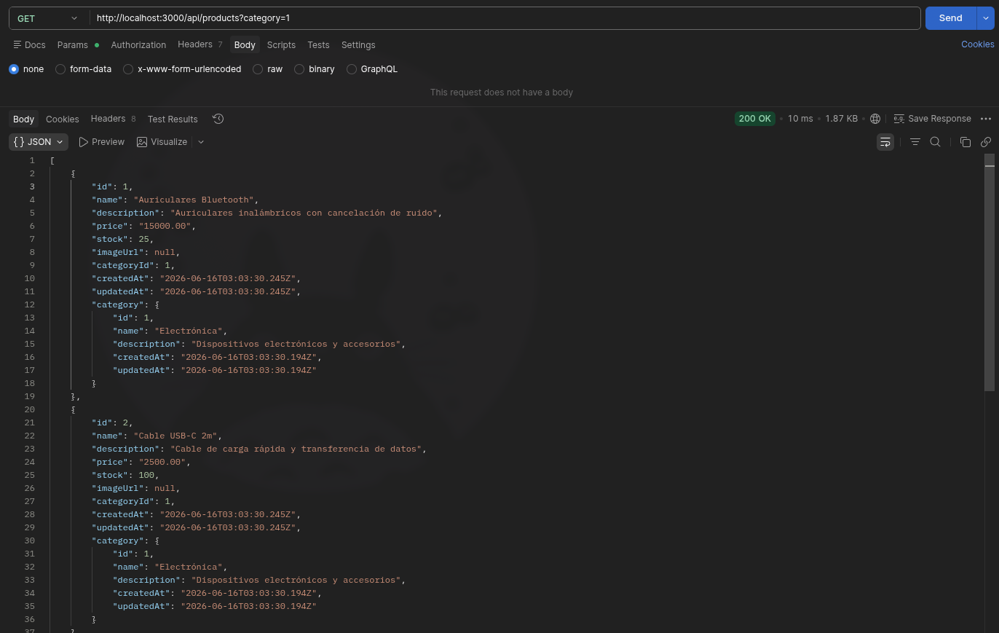

#### GET /api/products/:id
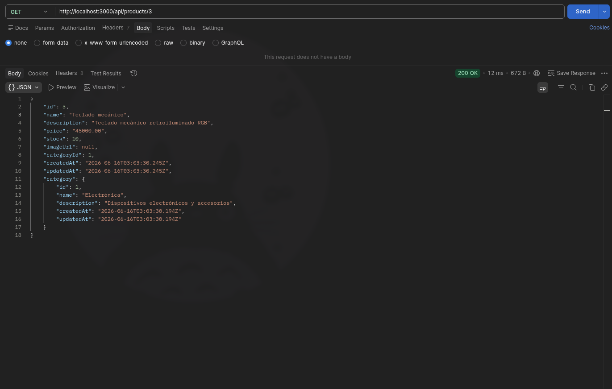


#### POST /api/products
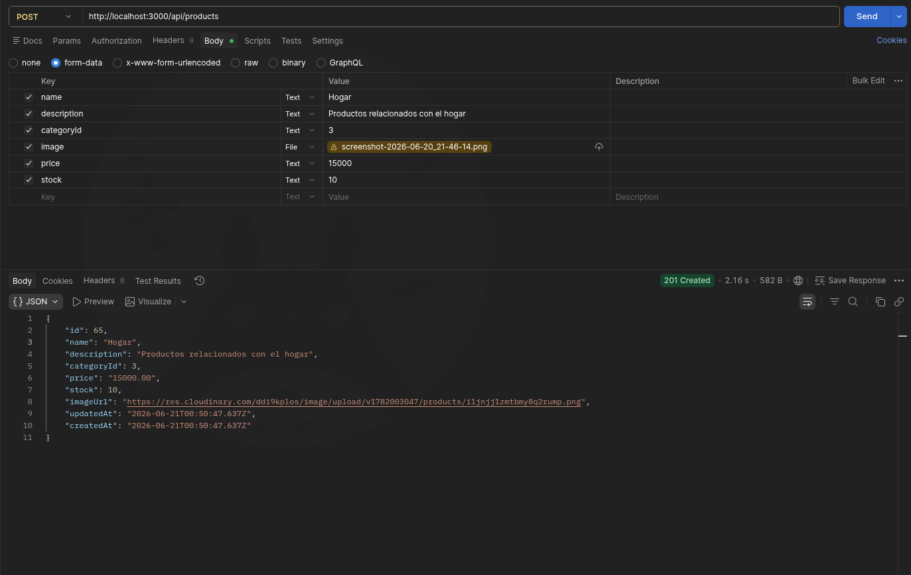


#### PUT /api/products/:id
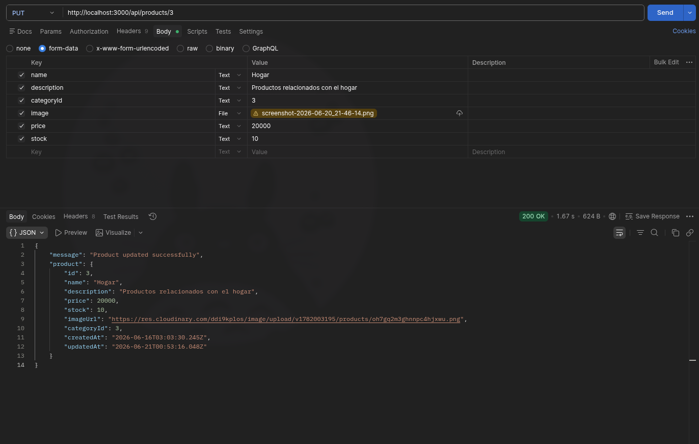


#### DELETE /api/products/:id
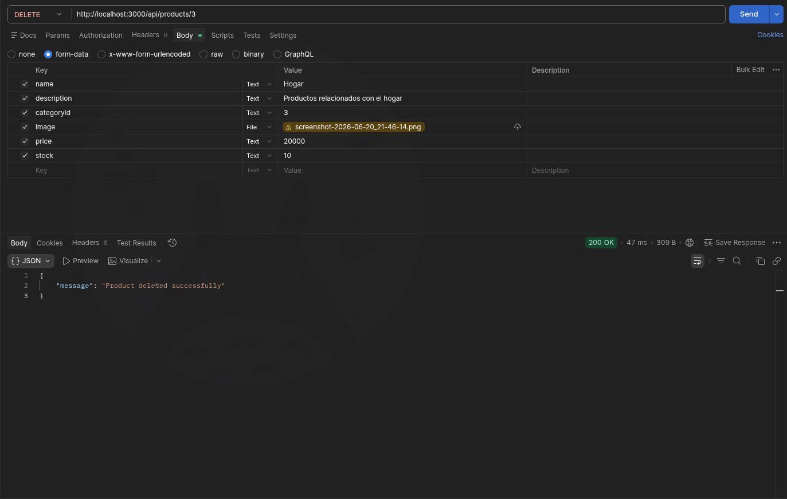
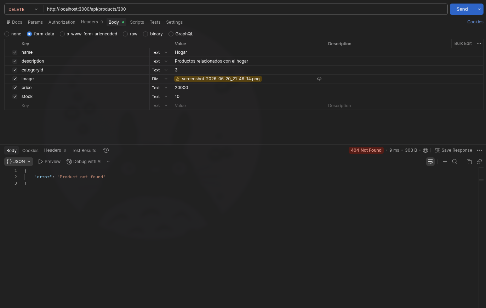

### Movements

#### GET /api/movements
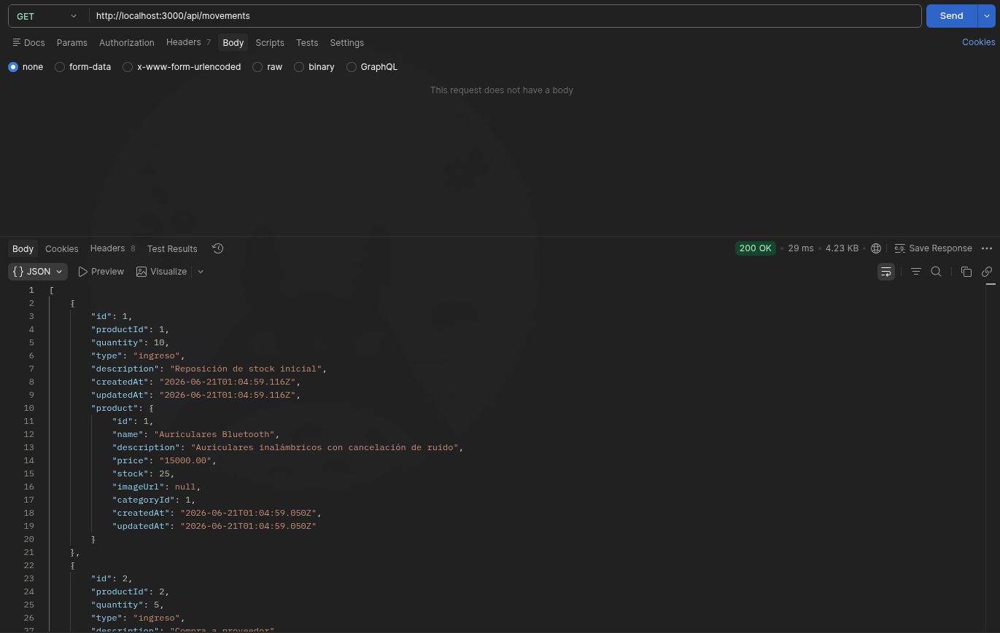

#### GET /api/movements/:id
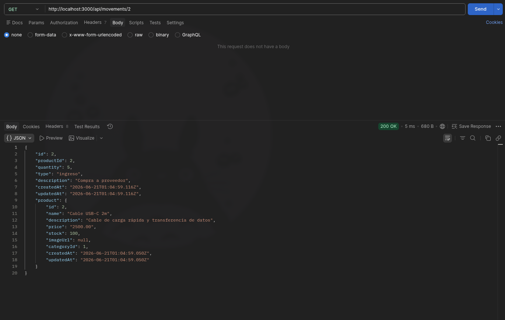


#### POST /api/movements

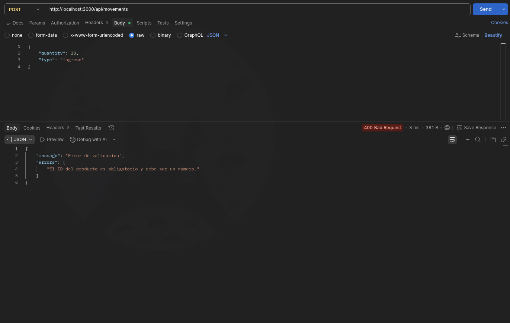

---

## Estructura de entidades

**Product**
```json
{
  "id": 1,
  "name": "Auriculares Bluetooth",
  "description": "Auriculares inalámbricos con cancelación de ruido",
  "price": 15000,
  "stock": 25,
  "imageUrl": "https://res.cloudinary.com/demo/image/upload/products/auriculares.jpg",
  "categoryId": 1,
  "createdAt": "2026-06-01T12:00:00.000Z",
  "updatedAt": "2026-06-01T12:00:00.000Z"
}
```

**Category**
```json
{
  "id": 1,
  "name": "Electrónica",
  "description": "Dispositivos electrónicos y accesorios",
  "createdAt": "2026-06-01T12:00:00.000Z",
  "updatedAt": "2026-06-01T12:00:00.000Z"
}
```

**Movement**
```json
{
  "id": 1,
  "productId": 1,
  "quantity": 10,
  "type": "ingreso",
  "description": "Reposición de stock",
  "createdAt": "2026-06-01T12:00:00.000Z",
  "updatedAt": "2026-06-01T12:00:00.000Z"
}
```

---

## Tecnologías utilizadas
- **Node.js**
- **Express**
- **TypeScript**
- **Multer**
- **Sequelize**
- **PostgreSQL**
- **Docker**
- **ESLint**
- **Prettier**
- **Husky**
- **lint-staged**
- **commitlint**
- **Git**

## Herramientas utilizadas
- **GitHub**
- **Render**
- **Neon**
- **Cloudinary**
- **Postman**

---
