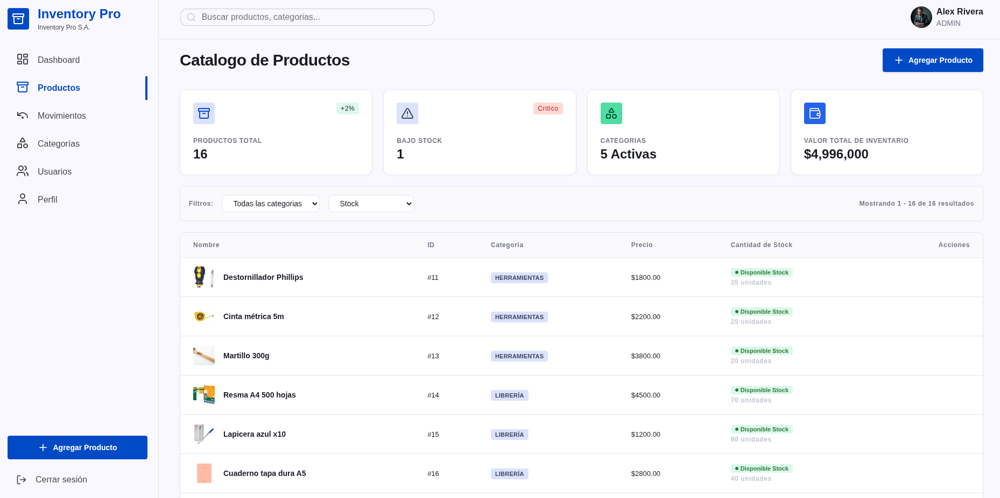
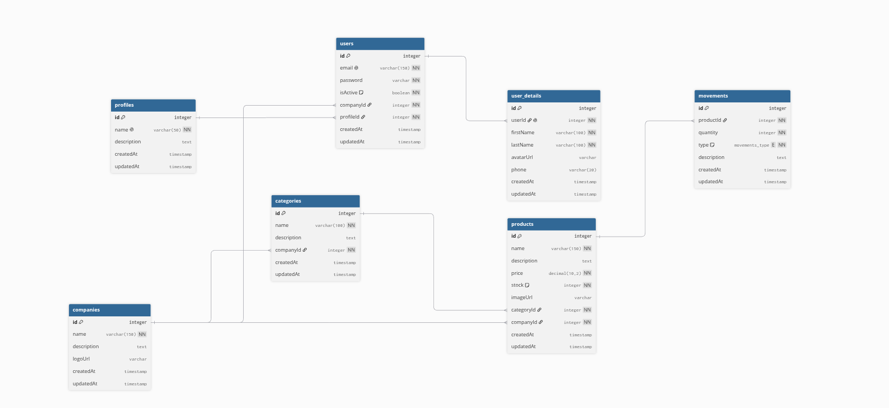

<div align="center">

# Inventory Pro

### Sistema de gestión de inventario para pequeños negocios.


## Integrantes - Grupo N-7

Iñaki Carcereny · Valentín De Pascale · Joaquín Marcilese · Ezequiel Barrionuevo · Alan Axel Hansen

</div>

---

## Descripción

Aplicación fullstack desarrollada con Node.js, Express y TypeScript en el backend, y React con Vite en el frontend, para la gestión de inventario de pequeños negocios. Permite realizar operaciones CRUD sobre productos, categorías y movimientos de stock, con soporte para carga de imágenes mediante Cloudinary y autenticación mediante JWT con sesiones gestionadas en Redis. Utiliza PostgreSQL como base de datos a través de Sequelize ORM, y está containerizada con Docker para facilitar el desarrollo y despliegue.

La aplicación sigue un modelo **multi-tenant**: cada empresa tiene su propio espacio de datos aislado. Al registrarse, el primer usuario se convierte automáticamente en **administrador** de su empresa. Desde el panel de gestión de usuarios, el administrador puede crear nuevos usuarios para su empresa y asignarles un rol — **admin** o **empleado** — que determina los permisos y las secciones visibles dentro de la aplicación. Los empleados acceden mediante las credenciales que el administrador les asigna y solo pueden operar sobre los datos de su propia empresa.

---

## Flujo y metodología de trabajo

| Rama | Descripción |
|------|-------------|
| `main` | Versión final de producción |
| `dev` | Integración de todas las features |
| `feature/*` | Nuevas funcionalidades |
| `refactor/*` | Mejoras y reestructuración del código |
| `docs/*` | Cambios en documentación |
| `fix/*` | Corrección de errores |
| `chore/*` | Tareas de mantenimiento y configuración |
| `test/*` | Pruebas unitarias |

El proyecto siguió una metodología colaborativa basada en **Git Flow**, donde cada funcionalidad se desarrolló en ramas independientes con el prefijo `feature/`. Una vez verificado que la funcionalidad cumplía con los requerimientos, se abría un **Pull Request** hacia la rama `dev` para revisión del equipo antes de aprobar el merge. La entrega final se realizó mediante un merge a `main`.

La arquitectura del proyecto sigue el patrón **MVC**, separando la lógica en capas bien diferenciadas: las rutas en `/routes` delegan las requests a los controladores en `/controllers`, los cuales se encargan exclusivamente de las respuestas HTTP. La lógica de consultas a la base de datos reside en métodos estáticos dentro de los modelos en `/models`, escritos en **TypeScript** con **Sequelize** como ORM. Las validaciones de los datos entrantes se realizan en la capa de **middlewares**, antes de que la request llegue al controlador. El frontend está desarrollado con **React** y **Vite**, organizado en páginas, componentes, servicios y contextos, siguiendo el mismo principio de separación de responsabilidades.

El entorno de desarrollo se estandarizó mediante **ESLint** y **Prettier** para mantener consistencia en el estilo del código, **Husky** con **lint-staged** para validar el formato y los errores antes de cada commit, **commitlint** para estandarizar los mensajes de commit, y **EditorConfig** junto con una configuración compartida de VSCode para garantizar uniformidad entre todos los integrantes del equipo.

El entorno de desarrollo está containerizado con **Docker**, utilizando **docker-compose** para orquestar los servicios de la API, la base de datos PostgreSQL y Redis. Las imágenes de productos y avatares de usuarios se almacenan en **Cloudinary**. El despliegue de la API se realizó en **Render** mediante una imagen de Docker, la base de datos PostgreSQL en **Neon**, y el frontend en **Vercel**.

---

## Convención de commits

| Prefijo | Uso |
|---------|-----|
| `feat:` | Nueva funcionalidad |
| `fix:` | Corrección de bug |
| `docs:` | Cambios en documentación |
| `style:` | Cambios de formato o estilo de código |
| `refactor:` | Reorganización de código |
| `chore:` | Configuración, dependencias o tareas de mantenimiento |

---

## Estructura del proyecto

```
/
├── .husky/                     # Hooks de Git (pre-commit, commit-msg)
├── .vscode/                    # Configuración compartida del editor
├── backend/
│   ├── controllers/            # Manejo de requests y respuestas HTTP
│   ├── core/                   # Configuración central (servidor)
│   ├── docs/                   # Documentación del backend
│   ├── lib/                    # Utilidades internas (configuración de DB, Redis, JWT)
│   ├── middlewares/            # Validaciones y procesamiento de requests
│   ├── models/                 # Entidades de la DB con métodos estáticos de consulta
│   ├── routes/                 # Definición de endpoints y registro de middlewares
│   ├── tests/                  # Tests del backend
│   ├── types/                  # Interfaces y tipos TypeScript compartidos
│   ├── utils/                  # Funciones auxiliares (ej: carga de imágenes)
│   ├── .dockerignore           # Archivos excluidos de la imagen Docker
│   ├── .env.example            # Variables de entorno requeridas
│   ├── .eslintignore           # Archivos excluidos de ESLint
│   ├── .eslintrc.json          # Configuración de ESLint
│   ├── app.ts                  # Entry point: inicialización de DB y servidor
│   ├── Dockerfile              # Imagen Docker de la API
│   ├── package.json            # Dependencias y scripts del backend
│   ├── tsconfig.json           # Configuración del compilador TypeScript
│   └── vitest.config.ts        # Configuración de tests
├── frontend/
│   ├── public/                 # Archivos estáticos
│   ├── src/
│   │   ├── assets/             # Imágenes y recursos estáticos
│   │   ├── components/         # Componentes
│   │   ├── context/            # Contextos de React (Auth, Modal, Search)
│   │   ├── hooks/              # Custom hooks
│   │   ├── layouts/            # Layouts de la aplicación
│   │   ├── lib/                # Utilidades internas del frontend
│   │   ├── pages/              # Páginas de la aplicación
│   │   ├── router/             # Configuración de React Router
│   │   ├── services/           # Llamadas a la API
│   │   ├── test/               # Tests del frontend
│   │   ├── types/              # Tipos TypeScript compartidos
│   │   ├── utils/              # Funciones auxiliares
│   │   ├── App.css             # Estilos globales de la aplicación
│   │   ├── App.tsx             # Componente raíz
│   │   ├── index.css           # Estilos base
│   │   └── main.tsx            # Entry point de React
│   ├── .gitignore              # Archivos excluidos del repositorio del frontend
│   ├── eslint.config.js        # Configuración de ESLint
│   ├── index.html              # HTML base
│   ├── package.json            # Dependencias y scripts del frontend
│   ├── pnpm-lock.yaml          # Lockfile de pnpm del frontend
│   ├── tsconfig.app.json       # Configuración de TypeScript para la app
│   ├── tsconfig.json           # Configuración base de TypeScript
│   ├── tsconfig.node.json      # Configuración de TypeScript para Node
│   └── vite.config.ts          # Configuración de Vite
├── .editorconfig               # Configuración de formato del editor
├── .gitignore                  # Archivos excluidos del repositorio
├── .prettierignore             # Archivos excluidos de Prettier
├── .prettierrc                 # Configuración de Prettier
├── commitlint.config.ts        # Reglas para mensajes de commit
├── docker-compose.yml          # Orquestación de servicios (API + PostgreSQL + Redis)
├── package.json                # Scripts globales del monorepo
├── pnpm-lock.yaml              # Lockfile de pnpm
├── tsconfig.json               # Configuración base de TypeScript
└── README.md                   # Documentación del proyecto

```
---

## División de tareas

| Integrante | Tareas |
|------------|--------|
| **Iñaki** | Modelos de `Product`, `Category`, `Company`, `Profile`, `User` y `UserDetails`, rutas y controlador de productos, configuración y arquitectura del proyecto (ESLint, Prettier, Husky, commitlint, EditorConfig, VSCode, Docker), middleware de carga de imágenes con Multer y Cloudinary, configuración de autenticación con JWT y Redis, controlador de autenticación (register, login, logout, me), middleware de autenticación, frontend con React y Vite (estructura, router, layouts, contextos de autenticación, modal y búsqueda global, páginas de login, registro, perfil y usuarios), servicios del frontend para comunicación con la API, despliegue de la API en Render, base de datos en Neon y frontend en Vercel, documentación. |
| **Valentín** | Modelo de Movement y trigger de actualización de stock y movimientos, documentación de endpoints en Postman, despliegue de la API en Render, base de datos en Neon, rutas y controladores de los modelos User,User-detail,Profile y Company, vista de Productos, test de las rutas de la API y los controladores, documentación de los nuevos 4 modelos User,User-detail,Profile y Company en Postman |
| **Alan** | Rutas y controlador de categorías. Implementación de middlewares de validación para los módulos `User`, `UserDetails`, `Profile` y `Company` — archivos `user.middleware.ts`, `user-detail.middleware.ts`, `profile.middleware.ts` y `company.middleware.ts`. `Company` valida que el nombre sea texto, no esté vacío y no supere los 150 caracteres. `User` verifica tipos de datos y formato del correo electrónico. `UserDetails` verifica que nombre, apellido y teléfono tengan el formato correcto. `Profile` verifica nombre y descripción. Los middlewares se integraron en las rutas correspondientes para ejecutarse antes de llegar al controlador. GET de empresas, usuarios, perfiles y detalles de usuario, y verificación de rechazo de solicitudes con datos inválidos (nombres vacíos, formatos incorrectos) retornando error 400. |
| **Ezequiel** | Rutas y controlador de movimientos, configuración de Docker Compose y filtrado de movimientos por empresa. Página de movimientos con listado, filtro por tipo (ingreso/egreso), buscador por nombre de producto y paginación. Modal para registrar nuevos movimientos con actualización en tiempo real de la tabla. Página de dashboard con métricas de inventario (stock bajo, valor total, últimos movimientos), panel de productos con bajo stock con barra de progreso y panel de últimos movimientos. **Pruebas:** registro de movimiento verificando guardado y actualización automática de la tabla, listado de movimientos con datos completos (producto, tipo, cantidad, descripción y fecha), filtro por tipo, buscador por nombre de producto, y verificación de métricas del dashboard con datos reales. |
| **Joaquín** | Middlewares de validación para productos, categorías y movimientos, frontend de categorías. |
---

## Diagrama



---

## Funcionalidades

### Backend

| Feature | Descripción |
|---------|-------------|
| **Configuración del servidor** | El servidor se inicializa como una clase `Server` que registra middlewares, rutas y levanta la aplicación en el puerto definido por variable de entorno. |
| **Middlewares globales** | Se configuran CORS y parseo de JSON para las requests entrantes. |
| **Middlewares de validación** | Se aplican middlewares de validación antes de los endpoints `POST` y `PUT` de cada recurso, verificando tipos, campos obligatorios y formatos de datos. |
| **Middleware de autenticación** | Verifica el token JWT en cada request protegida, comprueba que la sesión exista en Redis e inyecta el `userId`, `companyId` y `profileId` en `res.locals`. |
| **Carga de imágenes** | Se integra Multer para recibir archivos en las requests y Cloudinary para almacenarlos en la nube, guardando la URL resultante en la base de datos. |
| **Autenticación** | Registro de empresa y usuario administrador, inicio de sesión con generación de JWT y almacenamiento de sesión en Redis, cierre de sesión con invalidación del token y endpoint para recuperar el usuario autenticado. |
| **Modelos** | Clases escritas en TypeScript con Sequelize que definen la estructura, tipos y métodos estáticos de consulta de cada entidad (`Product`, `Category`, `Movement`, `Company`, `Profile`, `User`, `UserDetails`). |
| **Trigger de stock** | Función PostgreSQL que se ejecuta automáticamente al insertar un movimiento y actualiza el stock del producto afectado sumando o restando según el tipo (`ingreso` o `egreso`). |
| **Multi-tenant** | Todos los recursos están filtrados por `companyId`, garantizando que cada empresa solo acceda a sus propios datos. |
| **GET /api/products** | Devuelve todos los productos de la empresa. Soporta filtrado por nombre y categoría mediante query params. |
| **GET /api/products/:id** | Busca y devuelve un producto específico por su ID, incluyendo los datos de su categoría. |
| **POST /api/products** | Valida los datos recibidos, sube la imagen a Cloudinary si se adjunta una, y crea un nuevo producto. |
| **PUT /api/products/:id** | Modifica los datos de un producto existente. Si se adjunta una nueva imagen, la sube a Cloudinary. |
| **DELETE /api/products/:id** | Elimina un producto a partir de su ID. |
| **GET /api/categories** | Devuelve todas las categorías de la empresa. |
| **GET /api/categories/:id** | Busca y devuelve una categoría específica por su ID. |
| **POST /api/categories** | Valida los datos recibidos y crea una nueva categoría. |
| **PUT /api/categories/:id** | Modifica los datos de una categoría existente. |
| **DELETE /api/categories/:id** | Elimina una categoría. No permite eliminarla si tiene productos asociados. |
| **GET /api/movements** | Devuelve todos los movimientos de la empresa incluyendo los datos del producto asociado. |
| **GET /api/movements/:id** | Busca y devuelve un movimiento específico por su ID. |
| **POST /api/movements** | Valida y registra un nuevo movimiento. El trigger de la DB actualiza el stock automáticamente. |
| **GET /api/users** | Devuelve todos los usuarios de la empresa. Solo accesible para administradores. |
| **POST /api/users** | Crea un nuevo usuario para la empresa con el rol asignado por el administrador. |
| **PUT /api/users/:id** | Modifica los datos de un usuario existente. |
| **DELETE /api/users/:id** | Elimina un usuario de la empresa. |
| **PUT /api/user-details/:userId** | Actualiza la información personal del usuario (nombre, apellido, teléfono y avatar). |
| **GET /api/companies/me** | Devuelve los datos de la empresa del usuario autenticado. |
| **PUT /api/companies/me** | Modifica los datos de la empresa. |
| **GET /api/profiles** | Devuelve los perfiles disponibles del sistema (`admin`, `employee`). |

### Frontend

| Feature | Descripción |
|---------|-------------|
| **Autenticación** | Páginas de registro e inicio de sesión con validación de formularios, manejo de errores del backend y redirección automática al dashboard. |
| **Contexto de autenticación** | Gestiona el estado global del usuario autenticado, token JWT y funciones de login, registro y logout. Recupera el usuario automáticamente al recargar la página. |
| **Rutas protegidas** | Sistema de rutas que redirige al login si no hay sesión activa y restringe el acceso a ciertas páginas según el rol del usuario. |
| **Layout del dashboard** | Sidebar con navegación, header con buscador global y avatar del usuario, y área de contenido principal con `Outlet` de React Router. |
| **Búsqueda global** | Input en el header que filtra en tiempo real los productos, categorías y movimientos sin realizar nuevas peticiones al backend. |
| **Página de productos** | Listado paginado con filtros por categoría y estado de stock, métricas de inventario y modal para agregar nuevos productos con carga de imagen. |
| **Página de categorías** | Grilla de categorías con stock total calculado, opción de editar y eliminar con manejo de error cuando tiene productos asociados. |
| **Página de movimientos** | Historial de movimientos con filtros por tipo, búsqueda por producto, métricas de ingresos y egresos y modal para registrar nuevos movimientos. |
| **Página de perfil** | Visualización y edición de información personal del usuario con actualización de avatar, nombre, teléfono y email en tiempo real sin recargar la página. |
| **Página de usuarios** | Exclusiva para administradores. Tabla de usuarios de la empresa con opción de editar rol, estado y datos, eliminar usuarios y agregar nuevos mediante un modal. |
| **Contexto de modales** | Gestiona el estado global de apertura y tipo de modal activo, permitiendo abrir modales desde cualquier componente. |
| **Servicios** | Capa de comunicación con la API REST que centraliza los fetch, maneja errores y tipado de respuestas para cada recurso. |
| **SEO** | Metadatos dinámicos por página mediante `react-helmet-async` con título y descripción específicos para cada sección. |

---

## Documentación de la API

[Ver documentación completa en Postman](https://documenter.getpostman.com/view/50197693/2sBXwvK8uE)

---

## Estructura de entidades

**Company**
```json
{
  "id": 1,
  "name": "Inventory Pro S.A.",
  "description": "Empresa de gestión de inventario",
  "logoUrl": "https://res.cloudinary.com/demo/image/upload/companies/logo.jpg",
  "createdAt": "2026-06-01T12:00:00.000Z",
  "updatedAt": "2026-06-01T12:00:00.000Z"
}
```

**Profile**
```json
{
  "id": 1,
  "name": "admin",
  "description": "Administrador de la empresa",
  "createdAt": "2026-06-01T12:00:00.000Z",
  "updatedAt": "2026-06-01T12:00:00.000Z"
}
```

**User**
```json
{
  "id": 1,
  "email": "admin@inventorypro.com",
  "isActive": true,
  "companyId": 1,
  "profileId": 1,
  "createdAt": "2026-06-01T12:00:00.000Z",
  "updatedAt": "2026-06-01T12:00:00.000Z"
}
```

**UserDetails**
```json
{
  "id": 1,
  "userId": 1,
  "firstName": "Alex",
  "lastName": "Rivera",
  "avatarUrl": "https://res.cloudinary.com/demo/image/upload/avatars/alex.jpg",
  "phone": "+54 9 11 1234-5678",
  "createdAt": "2026-06-01T12:00:00.000Z",
  "updatedAt": "2026-06-01T12:00:00.000Z"
}
```

**Category**
```json
{
  "id": 1,
  "name": "Electrónica",
  "description": "Dispositivos electrónicos y accesorios",
  "companyId": 1,
  "createdAt": "2026-06-01T12:00:00.000Z",
  "updatedAt": "2026-06-01T12:00:00.000Z"
}
```

**Product**
```json
{
  "id": 1,
  "name": "Auriculares Bluetooth",
  "description": "Auriculares inalámbricos con cancelación de ruido",
  "price": 15000,
  "stock": 25,
  "imageUrl": "https://res.cloudinary.com/demo/image/upload/products/auriculares.jpg",
  "categoryId": 1,
  "companyId": 1,
  "createdAt": "2026-06-01T12:00:00.000Z",
  "updatedAt": "2026-06-01T12:00:00.000Z"
}
```

**Movement**
```json
{
  "id": 1,
  "productId": 1,
  "quantity": 10,
  "type": "ingreso",
  "description": "Reposición de stock",
  "createdAt": "2026-06-01T12:00:00.000Z",
  "updatedAt": "2026-06-01T12:00:00.000Z"
}
```

---

## Tecnologías utilizadas

### Backend
- **Node.js**
- **Express**
- **TypeScript**
- **Sequelize**
- **PostgreSQL**
- **Redis**
- **JWT**
- **Multer**
- **bcrypt**
- **Vitest**
- **Docker**
- **ESLint**
- **Prettier**
- **Husky**
- **lint-staged**
- **commitlint**
- **Git**

### Frontend
- **React**
- **Vite**
- **TypeScript**
- **React Router**
- **React Helmet Async**
- **ESLint**
- **Prettier**

## Herramientas utilizadas
- **GitHub**
- **Render**
- **Neon**
- **Cloudinary**
- **Postman**
- **Vercel**
- **dbdiagram.io**

---
